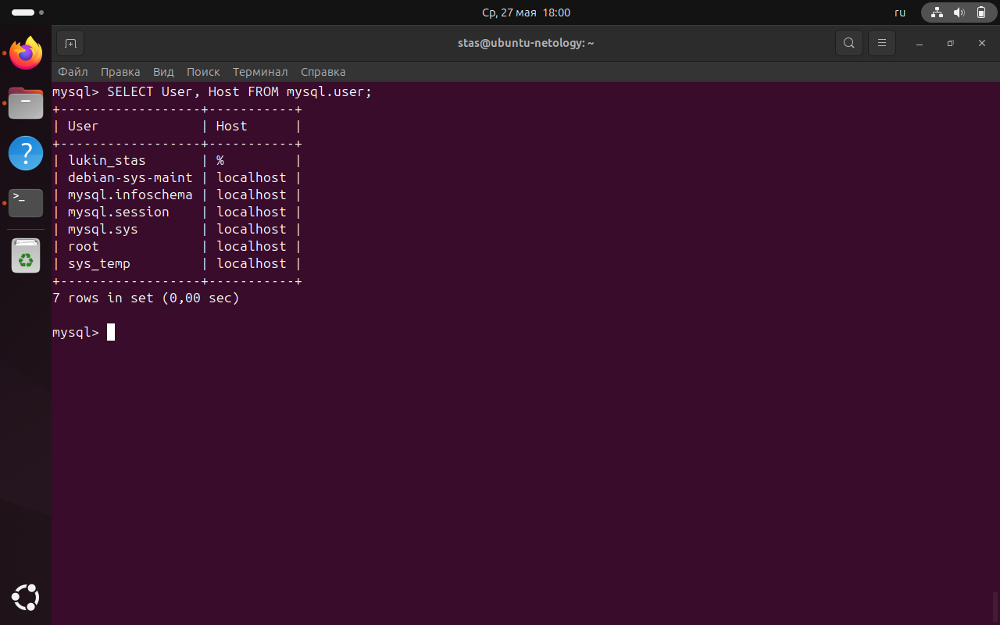
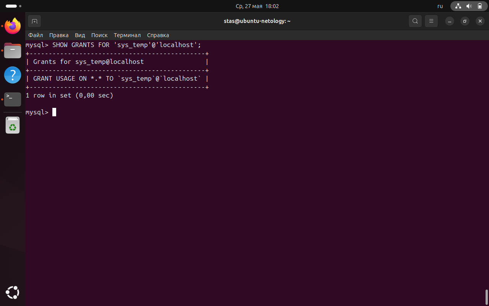
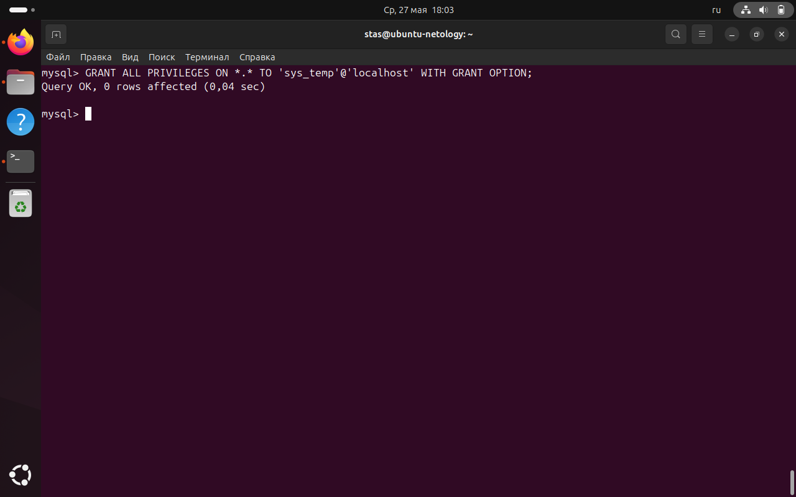
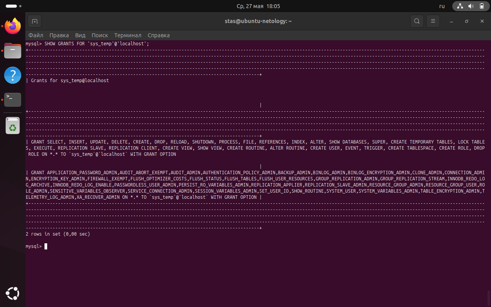
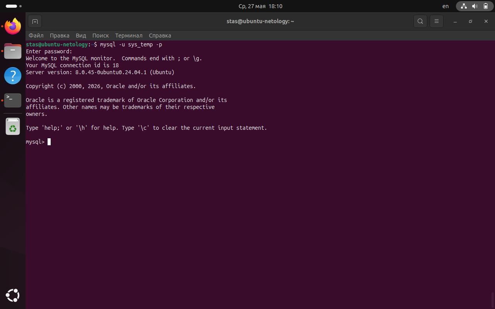
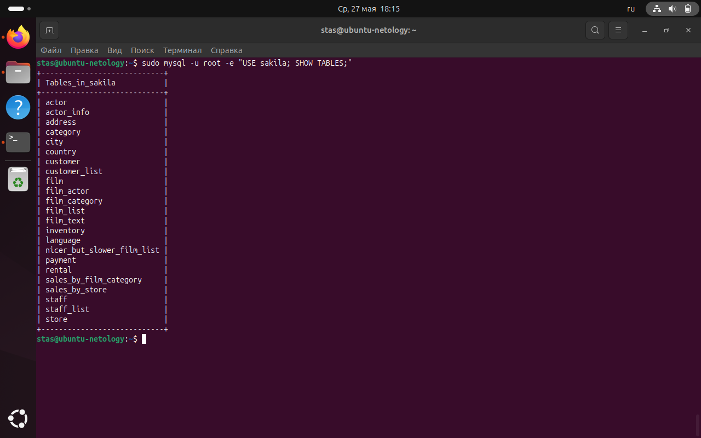
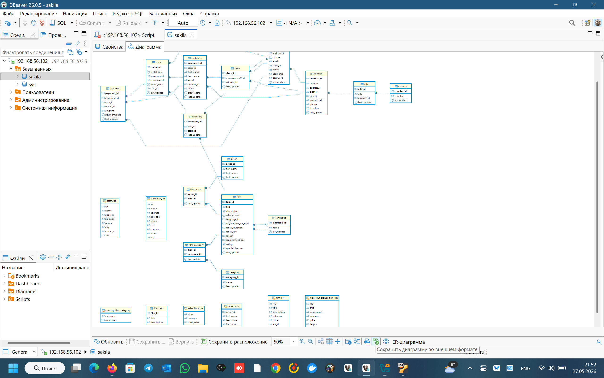

# Домашнее задание к занятию «Работа с данными (DDL/DML)»

**Студент:** Лукин Станислав

## Задание 1

### 1.2 Создание учётной записи sys_temp

```sql
CREATE USER 'sys_temp'@'localhost' IDENTIFIED BY 'stas';
```

### 1.3 Список пользователей

```sql
SELECT User, Host FROM mysql.user;
```

\

### 1.4 Права до выдачи

```sql
SHOW GRANTS FOR 'sys_temp'@'localhost';
```

\

### 1.5 Выдача всех прав

```sql
GRANT ALL PRIVILEGES ON *.* TO 'sys_temp'@'localhost' WITH GRANT OPTION;
FLUSH PRIVILEGES;
```

\

### 1.6 Права после выдачи

```sql
SHOW GRANTS FOR 'sys_temp'@'localhost';
```

\

### 1.7 Подключение от sys_temp

```bash
mysql -u sys_temp -p
```

\

### 1.8 Восстановление дампа Sakila

```bash
wget https://downloads.mysql.com/docs/sakila-db.zip
unzip sakila-db.zip
sudo mysql -u root < sakila-db/sakila-schema.sql
sudo mysql -u root < sakila-db/sakila-data.sql
```

```sql
USE sakila;
SHOW TABLES;
```

\

### 1.9 ER-диаграмма Sakila

\

## Задание 2

Таблица первичных ключей базы `sakila`:

| Название таблицы | Название первичного ключа |
|------------------|---------------------------|
| actor            | actor_id                  |
| address          | address_id                |
| category         | category_id               |
| city             | city_id                   |
| country          | country_id                |
| customer         | customer_id               |
| film             | film_id                   |
| film_actor       | actor_id, film_id         |
| film_category    | film_id, category_id      |
| film_text        | film_id                   |
| inventory        | inventory_id              |
| language         | language_id               |
| payment          | payment_id                |
| rental           | rental_id                 |
| staff            | staff_id                  |
| store            | store_id                  |

## Все использованные SQL-запросы

```sql
-- 1. Создание пользователя
CREATE USER 'sys_temp'@'localhost' IDENTIFIED BY 'stas';

-- 2. Просмотр пользователей
SELECT User, Host FROM mysql.user;

-- 3. Просмотр прав до выдачи
SHOW GRANTS FOR 'sys_temp'@'localhost';

-- 4. Выдача всех прав
GRANT ALL PRIVILEGES ON *.* TO 'sys_temp'@'localhost' WITH GRANT OPTION;
FLUSH PRIVILEGES;

-- 5. Просмотр прав после выдачи
SHOW GRANTS FOR 'sys_temp'@'localhost';

-- 6. Список таблиц Sakila
USE sakila;
SHOW TABLES;

-- 7. Получение первичных ключей
SELECT TABLE_NAME, COLUMN_NAME
FROM information_schema.KEY_COLUMN_USAGE
WHERE CONSTRAINT_NAME = 'PRIMARY' AND TABLE_SCHEMA = 'sakila'
ORDER BY TABLE_NAME;
```
