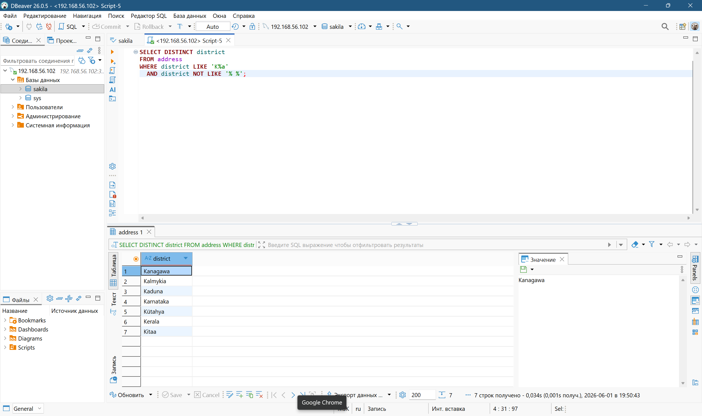
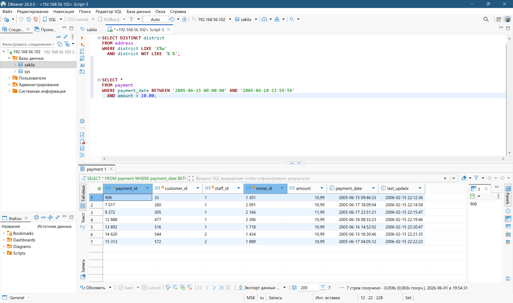
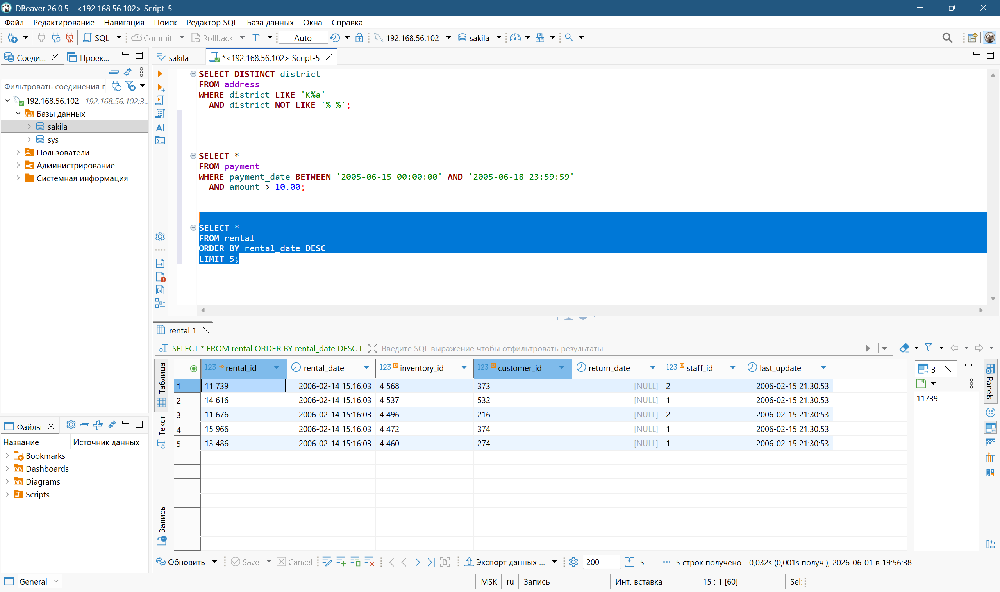
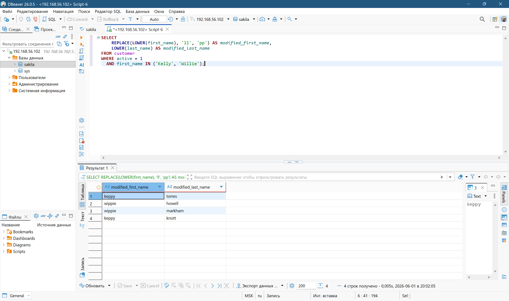

# Домашнее задание к занятию «SQL. Часть 1»

**Студент:** Лукин Станислав

## Задание 1

Получить уникальные названия районов из таблицы address, которые начинаются на "K", заканчиваются на "a" и не содержат пробелов.

```sql
SELECT DISTINCT district
FROM address
WHERE district LIKE 'K%a'
  AND district NOT LIKE '% %';
```

\

## Задание 2

Получить платежи за период с 15 по 18 июня 2005 года включительно, стоимостью более 10.00.

```sql
SELECT *
FROM payment
WHERE payment_date BETWEEN '2005-06-15 00:00:00' AND '2005-06-18 23:59:59'
  AND amount > 10.00;
```

\

## Задание 3

Последние пять аренд фильмов.

```sql
SELECT *
FROM rental
ORDER BY rental_date DESC
LIMIT 5;
```

\

## Задание 4

Активные покупатели с именами Kelly или Willie, с преобразованием регистра и заменой 'll' на 'pp'.

```sql
SELECT 
    REPLACE(LOWER(first_name), 'll', 'pp') AS modified_first_name,
    LOWER(last_name) AS modified_last_name
FROM customer
WHERE active = 1
  AND LOWER(first_name) IN ('kelly', 'willie');
```

\
